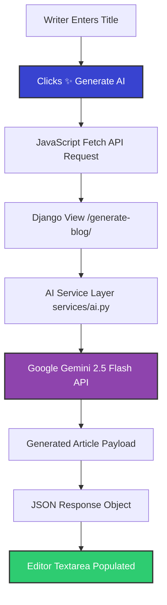
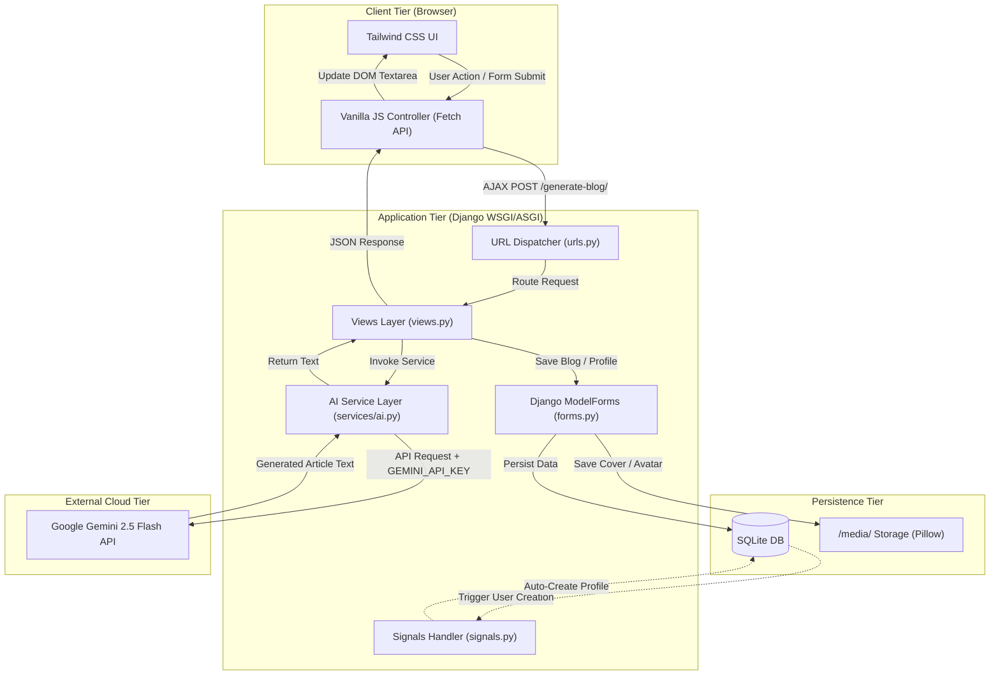

<div align="center">

# ✨ Discover — AI Powered Blogging Platform

[](https://www.djangoproject.com/)
[](https://www.python.org/)
[](https://tailwindcss.com/)
[](https://ai.google.dev/)
[](https://www.sqlite.org/)
[](https://opensource.org/licenses/MIT)

<br>

*A modern, distraction-free blogging platform built with **Django**, **Tailwind CSS**, and **Google Gemini AI** — designed for writers, creators, and readers.*

<br>

[📖 About](#-about-the-project) • [✨ Features](#-key-features) • [🤖 AI Assistant](#-ai-writing-assistant) • [🛠️ Tech Stack](#-technology-stack) • [🚀 Quick Start](#-installation--setup) • [🔮 Future Roadmap](#-future-roadmap)

---

</div>

## 📌 About the Project

**Discover** is a modern, production-ready AI-powered blogging platform inspired by premier editorial platforms like **Medium** and **Hashnode**. Built from the ground up to provide a seamless publishing experience, Discover combines a minimalist typography-first design with powerful backend engineering and real-time generative AI capabilities.

At its core, Discover empowers creators to overcome writer's block. By leveraging **Google Gemini AI**, writers can generate complete, professionally structured long-form articles in seconds, directly within an intuitive distraction-free editor.

> [!NOTE]
> Discover is fully responsive and features asynchronous AJAX blog generation, Django ORM database persistence, custom signal handlers for automated profile creation, and dynamic cover image uploads.

---

## 🏠 Editorial Home Feed

The home feed delivers a clean, editorial layout featuring a prominent spotlight post alongside a multi-column story grid highlighting published works, author metadata, publication dates, and cover images.

<div align="center">


*Figure 1: Discover Editorial Home Feed featuring hero story spotlight and dynamic article grid.*

</div>

---

## ✨ Key Features

Discover comes packed with a comprehensive set of features built for content creators and readers alike:

### 🤖 Generative AI & Content Creation
- **✅ Google Gemini AI Blog Generator**: Generate comprehensive long-form articles instantly from just a title or prompt.
- **✅ AI-Powered Article Writing**: Automatically structures articles with captivating introductions, section headers, bulleted takeaways, and conclusions.
- **✅ Decoupled AI Service Layer**: Modular architecture isolating AI prompt formatting and Gemini SDK client logic in `services/ai.py`.
- **✅ Asynchronous AJAX Generation**: Real-time content insertion without requiring page reloads or context switching.

### ✍️ Editorial & Publishing Suite
- **✅ Distraction-Free Writing Interface**: Clean canvas optimized for writing focus with instant title/content DOM syncing.
- **✅ Draft System**: Save post drafts to review, edit, or publish at your convenience.
- **✅ Publish Controls**: Instant one-click publishing transition from draft to live feed.
- **✅ Cover Image Upload**: Interactive drag-and-drop cover image dropzone supporting custom media uploads via Django Pillow integration.

### 👤 User Management & Customization
- **✅ Secure User Authentication**: Built-in signup, signin, and logout flows with password encryption and session auto-login upon registration.
- **✅ Profile Management**: Personal author portal showcasing metrics (articles count, readers, following), published articles, and draft quick-links.
- **✅ Edit Profile**: Avatar image uploader, live 250-character bio counter, and profile metadata management.

### 🔍 Search & Exploration
- **✅ Real-Time Search Engine**: Filter across article titles and body content using Django ORM lookup queries with clean empty states.
- **✅ Modern Responsive UI**: Tailored Tailwind CSS design system fully responsive across mobile, tablet, and desktop viewports.

---

## 🤖 AI Writing Assistant

The **Google Gemini AI Writing Assistant** is the centerpiece of Discover's writing workspace. Integrated directly into the story creator (`/create/`), it acts as an intelligent co-writer that drafts high-quality blog posts on demand.

> [!TIP]
> **How to use**: Simply type a post topic into the title field (e.g., *"The Future of Web Development with Django"*) and click **✨ Generate AI**. The assistant will generate a fully formatted article in seconds!

### 🔄 Asynchronous AI Workflow



### 📝 Generated Content Quality Matrix

When triggered, the AI service enforces strict prompt rules ensuring published articles meet top editorial standards:

| Section | Output Specification |
| :--- | :--- |
| **Headline & Hook** | Catchy, click-worthy title with an engaging opening paragraph. |
| **Section Headings** | Structured Markdown headers (`##`, `###`) for effortless readability. |
| **Key Takeaways** | Clean bulleted lists formatting complex ideas into scannable insights. |
| **Target Length** | In-depth ~800 to 1000-word comprehensive coverage of the topic. |
| **Wrap-up** | Concluding summary encouraging reader engagement and discussion. |

---

## ✍️ Distraction-Free Story Creator

The editor interface combines minimalism with maximum utility, incorporating a drag-and-drop cover image zone, real-time input synchronization, AI generation controls, and status actions.

<div align="center">


*Figure 2: Story Creator interface showcasing the **✨ Generate AI** action button and live cover dropzone.*

</div>

> [!NOTE]
> The editor uses Vanilla JavaScript to continuously synchronize visible editor fields with hidden Django form inputs, guaranteeing zero data loss during submission.

---

## 👤 Profile & Author Dashboard

Every user receives a personal profile dashboard displaying publication metrics, live article feeds, saved drafts, and quick navigation links.

<div align="center">


*Figure 3: Author profile dashboard displaying total published articles, draft count, and published stories feed.*

</div>

---

## 📝 Saved Drafts Workspace

Discover features a dedicated `/drafts/` hub where authors can manage unfinished articles, preview formatting, and publish posts to the public feed when ready.

<div align="center">


*Figure 4: Drafts management workspace providing easy access to edit or publish saved drafts.*

</div>

---

## 🔍 Search & Exploration Engine

Find content instantly using the search engine. Discover queries both story titles and content bodies using Django ORM `Q` lookup objects to deliver relevant search results.

<div align="center">


*Figure 5: Search and exploration screen with real-time keyword filtering.*

</div>

---

## ⚙️ Profile Customization

Writers can customize their public presence by updating their avatar, adjusting profile metadata, and writing a bio with a live character count guardrail.

<div align="center">


*Figure 6: Profile editor with avatar upload dropzone and live bio character counter.*

</div>

---

## 🔐 Authentication & Onboarding

Discover provides streamlined account registration and login pages styled cleanly with error alert handling and instant session login.

<div align="center">

| Sign In Page | User Registration |
| :---: | :---: |
|  |  |
| *Figure 7: Minimalist Sign In screen.* | *Figure 8: Account registration screen with auto-login.* |

</div>

---

## 🛠️ Technology Stack

Discover is engineered using production-grade open-source technologies:

| Technology | Category | Purpose & Implementation |
| :--- | :--- | :--- |
| **Python 3.12** | Language | Primary backend language |
| **Django 6.0** | Web Framework | MVC architecture, ORM model mapping, URL routing, authentication & signals |
| **Google Gemini AI** | AI Engine | Article generation powered by `google-genai` SDK (`gemini-2.5-flash` model) |
| **Tailwind CSS v4** | Styling | Modern, utility-first UI design system & responsive layout engine |
| **JavaScript (ES6+)** | Frontend Logic | Asynchronous Fetch API AJAX requests, DOM input sync & character counters |
| **SQLite3** | Database | Relational database persisting users, profiles, and blog posts |
| **Pillow** | Image Engine | Processing and managing user profile avatars and article cover photos |
| **Heroicons** | Iconography | Crisp SVG icons for enhanced user experience |

---

## 🏗️ System Architecture & Data Flow

The following architecture diagram outlines how Discover handles user interactions, database queries, and external AI services:



---

## 📁 Project Structure

```text
Blog_App/
├── assets/
│   ├── design_references/      # Official design reference specifications
│   └── screenshots/            # Live application screenshots
├── django_blog/
│   ├── blog/
│   │   ├── migrations/         # Database migration files
│   │   ├── services/
│   │   │   ├── __init__.py
│   │   │   └── ai.py           # Gemini AI generation service
│   │   ├── static/             # Static assets & compiled output.css
│   │   ├── templates/blog/     # Django HTML templates
│   │   │   ├── auth_base.html  # Authentication layout template
│   │   │   ├── base.html       # Main application layout template
│   │   │   ├── create_post.html# Story creator & AI generator interface
│   │   │   ├── drafts.html     # Saved drafts management page
│   │   │   ├── edit_profile.html# Profile editing interface
│   │   │   ├── home.html       # Editorial home feed
│   │   │   ├── login.html      # User login view
│   │   │   ├── post_detail.html# Full article detail view
│   │   │   ├── profile.html    # Author profile & stats view
│   │   │   ├── register.html   # User registration view
│   │   │   └── search.html     # Search results view
│   │   ├── admin.py            # Django Admin registration
│   │   ├── apps.py             # App configuration
│   │   ├── forms.py            # ModelForms for Blog & Profile
│   │   ├── models.py           # Blog & Profile data models
│   │   ├── signals.py          # Automatic profile creation signal
│   │   ├── tests.py            # Django automated test suite
│   │   ├── urls.py             # Blog application URL routing
│   │   └── views.py            # View functions & AJAX handlers
│   ├── django_blog/            # Root project configuration
│   │   ├── settings.py         # Global Django settings
│   │   ├── urls.py             # Root URL routing
│   │   └── wsgi.py             # WSGI entry point
│   ├── manage.py               # Django CLI management script
│   └── test_ai.py              # Standalone Gemini API verification script
├── .env                        # Environment variables configuration
├── .gitignore                  # Git ignore rules
└── README.md                   # Project documentation
```

---

## 🚀 Installation & Setup

Follow these steps to get a local copy of Discover running on your system:

### 1. Prerequisites
Ensure you have installed:
- **Python 3.10+**
- **Git**

---

### 2. Step-by-Step Installation

#### Step 1: Clone the Repository
```bash
git clone https://github.com/adityamishra30/Blog_Application.git
cd Blog_Application
```

#### Step 2: Create & Activate Virtual Environment
```bash
# On Windows:
python -m venv venv
venv\Scripts\activate

# On macOS / Linux:
python3 -m venv venv
source venv/bin/activate
```

#### Step 3: Install Dependencies
```bash
pip install django pillow python-dotenv google-genai
```

#### Step 4: Setup Environment Variables
Create a `.env` file in the root directory:
```env
GEMINI_API_KEY=your_google_gemini_api_key_here
SECRET_KEY=your_django_secret_key
DEBUG=True
```

> [!IMPORTANT]
> You can obtain a free **Google Gemini API Key** from [Google AI Studio](https://aistudio.google.com/).

#### Step 5: Run Database Migrations
```bash
cd django_blog
python manage.py migrate
```

#### Step 6: Verify AI Integration *(Optional)*
Test your Gemini API key and connectivity with the included test script:
```bash
python test_ai.py
```

#### Step 7: Launch the Server
```bash
python manage.py runserver
```

Open your browser and navigate to **`http://127.0.0.1:8000/`**.

---

## 🔑 Environment Variables Reference

Discover uses `python-dotenv` to manage application environment settings securely.

| Variable | Required | Description | Example |
| :--- | :---: | :--- | :--- |
| `GEMINI_API_KEY` | **Yes** | API key used by `services/ai.py` to authenticate with Google Gemini API | `AIzaSyD...` |
| `SECRET_KEY` | No | Django cryptographic signing secret key | `django-insecure-...` |
| `DEBUG` | No | Enables debug mode during development (`True` / `False`) | `True` |

---

## 🔮 Future Roadmap

We are continuously working to enhance Discover. Key planned features on the horizon include:

- [ ] **🤖 AI Content Summarizer**: One-click AI summaries for long articles in the feed.
- [ ] **🔍 AI SEO Generator**: Automated meta title, description, and keyword generation.
- [ ] **🏷️ AI Tag Generator**: Automatic topic tagging based on article content.
- [ ] **✨ Grammar & Tone Polisher**: Real-time AI grammar check and tone adjustment.
- [ ] **📝 WYSIWYG Markdown Editor**: Integrated rich-text / markdown live preview editor.
- [ ] **💬 Interactive Comments System**: Reader discussion threads under published posts.
- [ ] **🔖 Bookmarks & Reading List**: Save favorite stories to personal reading lists.
- [ ] **👏 Article Likes & Claps**: Interactive reader appreciation counters.
- [ ] **🔔 Real-Time Notifications**: In-app notifications for likes, comments, and new followers.

---

## 🤝 Contributing

Contributions make the open-source community an amazing place to learn, inspire, and create. Any contributions you make are **greatly appreciated**!

1. Fork the Project
2. Create your Feature Branch (`git checkout -b feature/AmazingFeature`)
3. Commit your Changes (`git commit -m 'Add some AmazingFeature'`)
4. Push to the Branch (`git push origin feature/AmazingFeature`)
5. Open a Pull Request

---

## 📄 License

Distributed under the **MIT License**. See `LICENSE` for more information.

---

## 👨‍💻 Author

<div align="center">

**Aditya Mishra**

[](https://github.com/adityamishra30)

*Made with ❤️ by Aditya Mishra*

</div>
