<div align="center">

# ✨ Discover — Minimalist Premium Publishing Platform

[](https://www.djangoproject.com/)
[](https://www.python.org/)
[](https://tailwindcss.com/)
[](https://ai.google.dev/)
[](https://opensource.org/licenses/MIT)

*An editorial publishing platform built with **Django**, styled with **Tailwind CSS**, and supercharged with **Google Gemini AI**.*

[Explore Features](#-key-features) • [AI Writing Assistant](#-google-gemini-ai-writing-assistant) • [Live Screenshots](#-live-application-screenshots) • [Tech Stack](#-technology-stack) • [Quick Start](#-getting-started)

---

</div>

## 📌 Overview

**Discover** is a minimalist, distraction-free publishing platform inspired by modern editorial leaders like *Medium*, *Notion*, *Hashnode*, and *GitHub*. Designed for writers and creators, Discover pairs an ultra-clean UI with robust Django backend features and a real-time **Google Gemini AI Writing Assistant** that turns article topics into complete, structured drafts in seconds.

> [!NOTE]
> Discover is fully responsive, production-ready, and built using custom Tailwind CSS components, Django ORM database architecture, custom signal handlers, and AJAX-driven AI generation services.

---

## ✨ Key Features

- **🤖 Google Gemini AI Writing Assistant**: Automatically generates structured, 800–1000 word blog articles directly from a title or topic using `gemini-2.5-flash`.
- **✍️ Distraction-Free Story Creator**: Clean editor equipped with image drag-and-drop cover uploads, instant AI content generation, and dual-mode **Publish** or **Save as Draft** capabilities.
- **📰 Editorial Home Feed**: Spotlight hero story layout paired with a dynamic multi-column story grid synced to Django database querysets.
- **🔐 User Authentication & Auto-Login**: Seamless user registration with automatic login session establishment and real-time status alerts.
- **📂 Draft Posts Management**: Dedicated `/drafts/` workspace where authors can organize, preview, and publish saved drafts when ready.
- **👤 Author Profile & Stats Dashboard**: Personal portal tracking published articles, drafts, reader metrics, and user bio settings.
- **🎨 Profile Customization**: Custom avatar uploads, real-time 250-character bio counters, and user metadata management.
- **🔍 Real-Time Search Engine**: Django queryset filtering searching across article titles and content strings.

---

## 🤖 Google Gemini AI Writing Assistant

Discover integrates Google Gemini AI (`google-genai` SDK) directly into the story creation flow to boost creator productivity.

> [!TIP]
> Just type an article title and hit **✨ Generate AI**. The app fetches a structured draft asynchronously without refreshing the page!

### ⚙️ How AI Generation Works

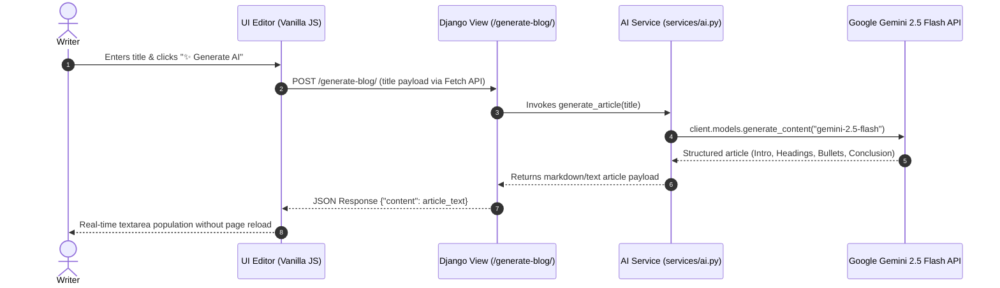

### 📋 AI Prompt Requirements Matrix
When requested, Gemini generates content matching rigorous publishing standards:
- **Title & Intro**: High-engagement headline & hook.
- **Structure**: Markdown headers (`##`, `###`) for clear readability.
- **Key Takeaways**: Bullet points for fast scanning.
- **Length**: ~800–1000 words.
- **Conclusion**: Summary and concluding thoughts.

---

## 📸 Live Application Screenshots

<details open>
<summary><b>Click to expand / collapse live interface showcase</b></summary>

<br>

| Feature Screen | Preview |
| :--- | :--- |
| **1. Editorial Home Feed**<br>*Hero spotlight & multi-column story grid* | 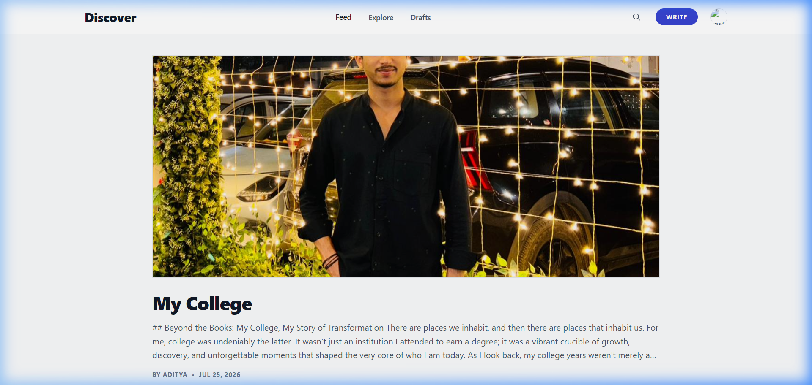 |
| **2. Story Creator & AI Generator**<br>*Distraction-free editor with **✨ Generate AI*** | 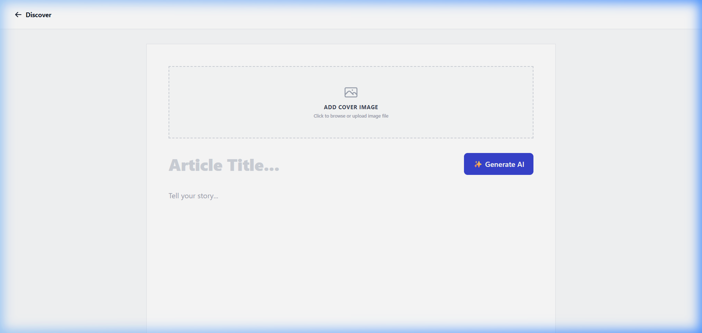 |
| **3. Author Profile & Metrics**<br>*Author portal & publication metrics* | 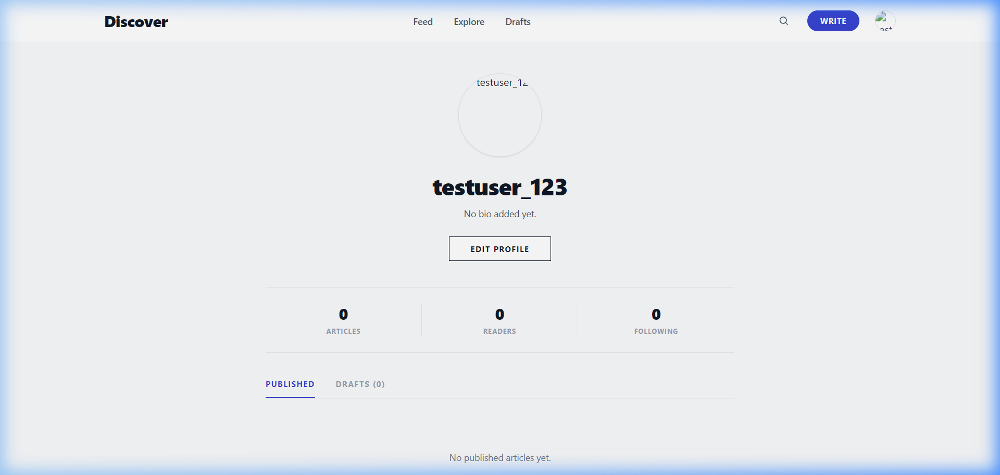 |
| **4. Draft Management Workspace**<br>*Saved drafts overview & publishing controls* | 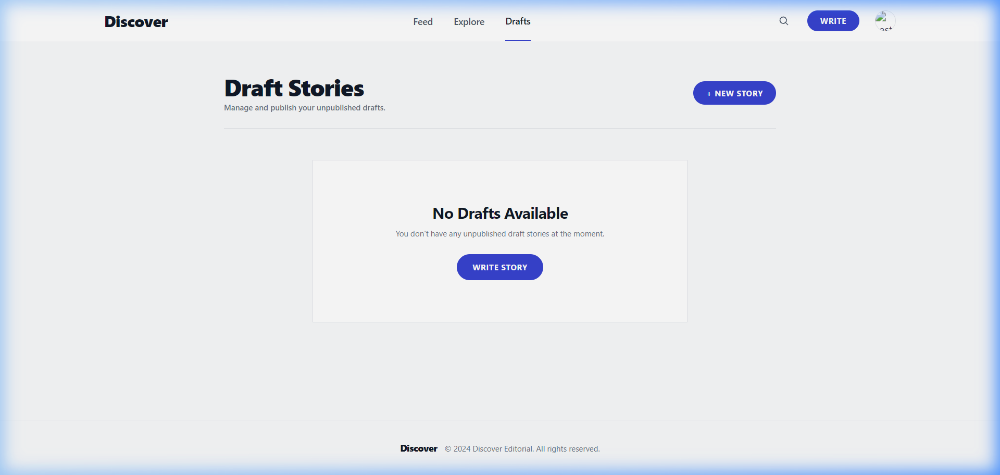 |
| **5. Real-Time Search Engine**<br>*Instant filter for story titles & contents* | 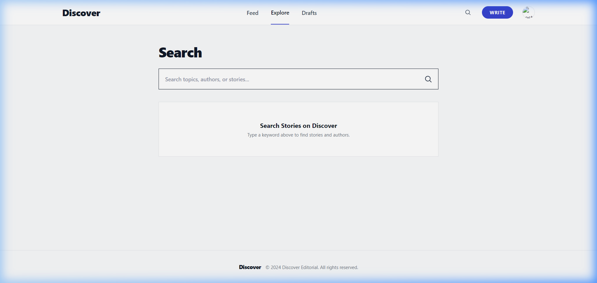 |
| **6. Profile & Bio Customization**<br>*Avatar upload & bio character limit counter* | 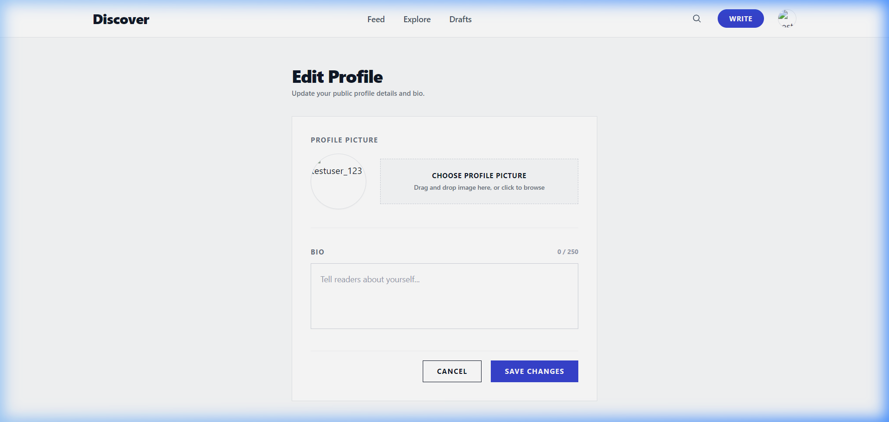 |
| **7. Sleek Sign-In Page**<br>*Minimalist user authentication* | 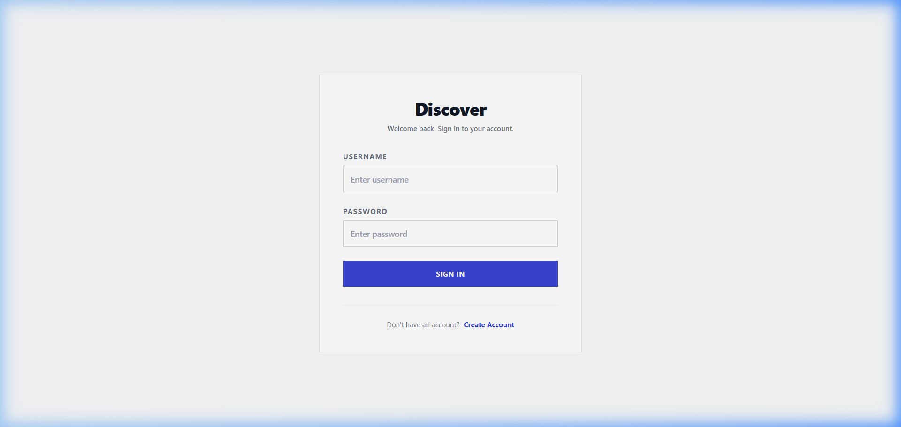 |
| **8. Quick User Registration**<br>*Account creation with auto-session login* | 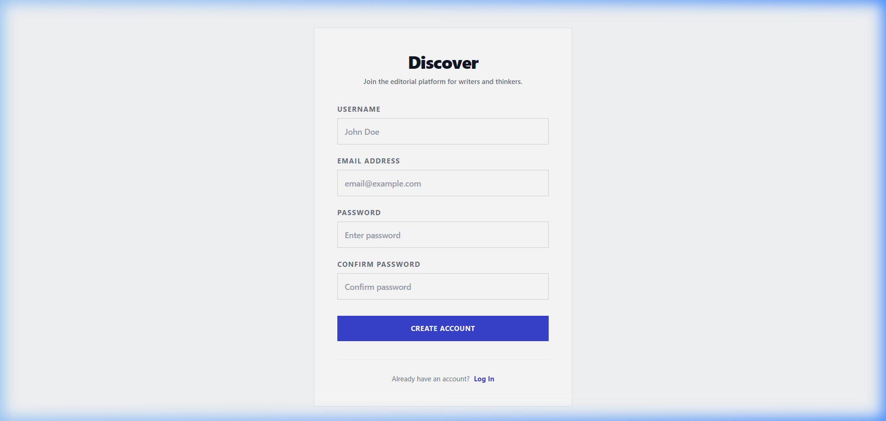 |

</details>

---

## 🎨 Design References & UI Specifications

<details>
<summary><b>Click to view original design mockups</b></summary>

<br>

- **Home Feed Reference**: 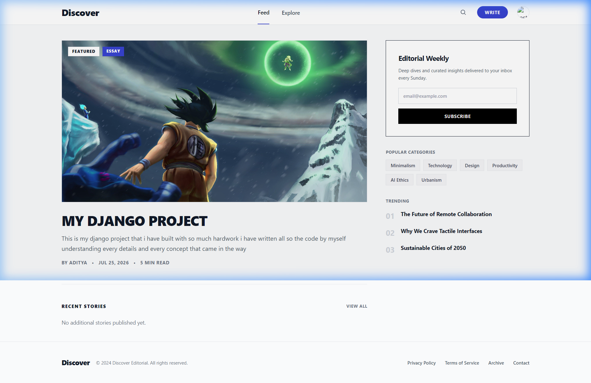
- **Editor Reference**: 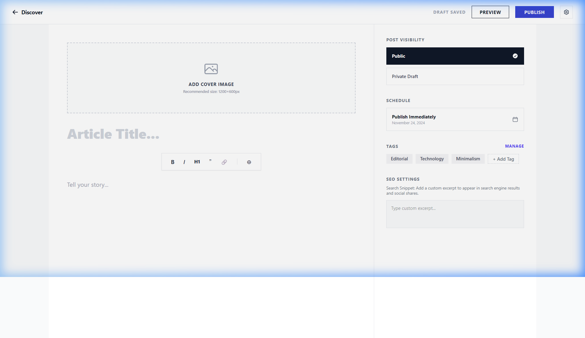
- **Profile Reference**: 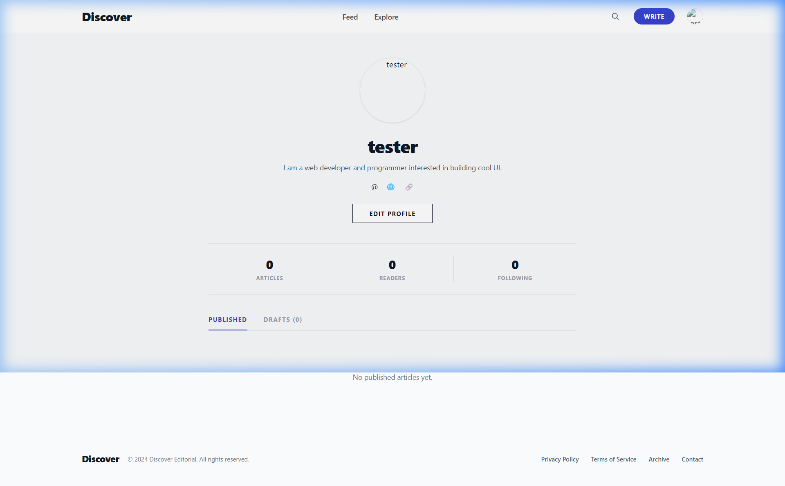
- **Search Reference**: 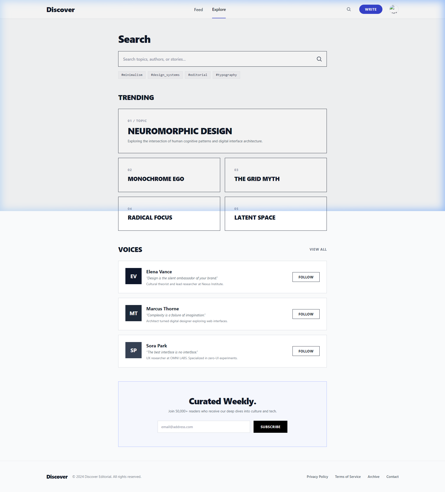
- **Edit Profile Reference**: 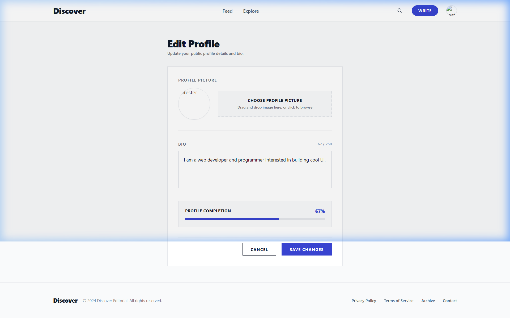

</details>

---

## 🛠️ Technology Stack

| Layer | Technologies & Tools | Description |
| :--- | :--- | :--- |
| **Backend** | Python 3.12, Django 6.0 | Core MVC framework, ORM, authentication & URL routing |
| **AI Engine** | Google Gemini 2.5 Flash (`google-genai`), `python-dotenv` | LLM article generation service |
| **Frontend** | HTML5, JavaScript (ES6+), Fetch API | Interactivity, AJAX AI invocation & input syncing |
| **Styling** | Tailwind CSS v4, Heroicons | Minimalist design system, typography & icons |
| **Database** | SQLite3 | Relational store for stories, users & profiles |
| **Media Handling** | Pillow (`ImageField`) | Profile avatars and article cover photos |

---

## 🚀 Getting Started

### 📋 Prerequisites
Ensure you have the following installed on your machine:
- **Python 3.10+**
- **Node.js 18+** (for Tailwind CSS compilation if building from source)
- **Git**

---

### 💻 Quick Step-by-Step Setup

#### 1. Clone the Repository
```bash
git clone https://github.com/adityamishra30/Blog_Application.git
cd Blog_Application
```

#### 2. Set Up & Activate Virtual Environment
```bash
# Windows:
python -m venv venv
venv\Scripts\activate

# macOS / Linux:
python3 -m venv venv
source venv/bin/activate
```

#### 3. Install Python Dependencies
```bash
pip install django pillow python-dotenv google-genai
```

#### 4. Configure Environment Variables
Create a `.env` file in the root directory (or in `django_blog/`):
```env
GEMINI_API_KEY=your_google_gemini_api_key_here
```
> [!IMPORTANT]
> Obtain a free Gemini API key from [Google AI Studio](https://aistudio.google.com/).

#### 5. Apply Database Migrations
```bash
cd django_blog
python manage.py migrate
```

#### 6. Verify Gemini AI Integration *(Optional)*
Verify API connectivity and test the generation script:
```bash
python test_ai.py
```

#### 7. Launch Development Server
```bash
python manage.py runserver
```
Visit **`http://127.0.0.1:8000/`** in your browser!

---

## 📁 Repository Structure

```text
Blog_App/
├── assets/
│   ├── design_references/     # Original design reference specifications
│   └── screenshots/           # Application screenshots for README
├── django_blog/
│   ├── blog/
│   │   ├── migrations/        # Django database migrations
│   │   ├── services/
│   │   │   └── ai.py          # Gemini AI generation service
│   │   ├── static/            # Compiled Tailwind CSS output (output.css)
│   │   ├── templates/blog/    # Application HTML templates
│   │   ├── admin.py           # Admin portal registration
│   │   ├── forms.py           # ModelForms for Blog & Profile
│   │   ├── models.py          # Blog post & Profile models
│   │   ├── signals.py         # Signal handlers for profile auto-creation
│   │   ├── tests.py           # Django test suite
│   │   ├── urls.py            # Blog app URL routing
│   │   └── views.py           # Controller logic & AJAX endpoint handlers
│   ├── django_blog/           # Core project settings & global URLs
│   ├── manage.py              # Django management CLI
│   └── test_ai.py             # Standalone Gemini AI API test script
├── .gitignore                 # Git ignore rules
└── README.md                  # Project documentation
```

---

## 🤝 Contributing

Contributions, issues, and feature requests are welcome! Feel free to check the issues page or submit a Pull Request.

---

## 📄 License

This project is open-source under the [MIT License](LICENSE).

```text
Made with ❤️ by Aditya Mishra
```
